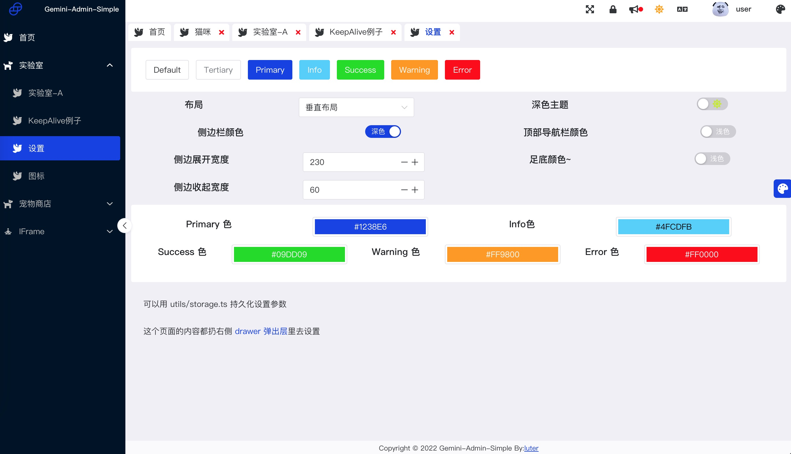
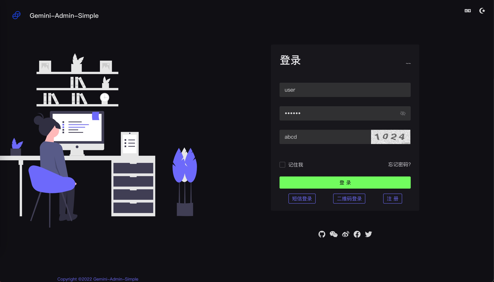
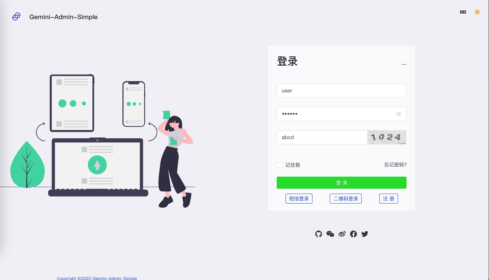
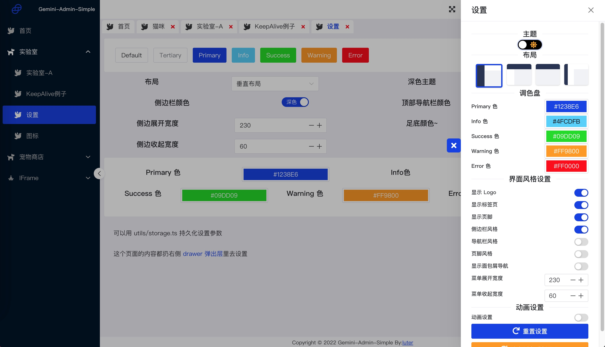
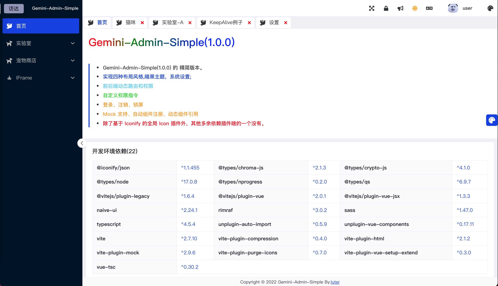

# Gemini UI Simple template
 基于 Naive UI 的 简单版 admin 模板。具备中后台模板的基本功能和 Icon 组件，无其它组件
 免费、开源、不复杂、东西少、好上手。

## 功能介绍
* vite2 +Vue3+Typescript+pinia+vue router4
* 前后端动态路由和权限
* permissions 权限判断指令
* 登录和锁屏
* 四种布局风格
* iconify 图标，支持离线和在线使用。

## 使用
### 克隆代码
```shell
# git clone https://github.com/luterc/gemini-admin-ui-simple.git
```

### 安装依赖
```shell
# cd gemini-admin-ui-simple
# yarn 
```

### 开发调试

```shell
# yarn dev
```
### 打包构建

```shell
# yarn build
```

## 大概长这样






## 致谢
开发过程中学习和参考了如下框架，一并感谢

* <a href="https://www.naiveui.com/">Naive UI</a>
* <a href="https://vvbin.cn/next">VBen Admin </a>
* <a href="https://github.com/honghuangdc/soybean-admin">Soybean Admin</a>